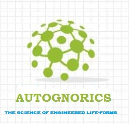

### WELCOME TO THE WORLD OF ANEURAL AUTOGNORICS 👋
[HOME](https://autognorics.github.io/) 

This hub is neither about Artificial Intelligence (A.I.) nor Machine Learning (M.L.) but it is all about AutoGnorics,
or the Science of Engineered Life Forms or SELFs.

Autognorics is a new higher school of thought that deals with creating engineered life forms, 
machines, things, and systems based on natural system through Intuitive objects, Embedded Inscriptions, Dimetrics
Reverse Inverse Theory, and Inscription by Design.

The Revisionist Ideas:
This is a paradigm shift that redefines the essential elements that come along with the criteria of life, 
based on the axiom that Life evolves from being alive to being living, a process governed by six stages.

- The Six Orders of Life:
1. Aliveness = the ability to consume energy without the need for neural reasoning.
2. Awareness = the ability to send and receive signals using IOs without the need for neural reasoning.
3. Consciouness = the ability to match things with things without the need for neural reasoning.
4. Intutiveness = the ability to choose between this or that without the need for neural reasoning.
5. Neuralness = the ability to self-acknowledge information (a brain without the brain)
6. Living = the ability to experience life (eafthos)

The new concept Autognorics was uncovered from the study on Orignemology.

Originemology is the science behind the beginning of everything, the "study of the origin of origins". It is a pioneering discipline that examines generally the roots or origins of everything and everyone based on the natural emergence of instructions comprehensively known as Creation by Law.

This new school of thought was conceptualized mainly to determine the Genesis of Information - the origin, creation, and evolution of early primordial, ancient, and modern information based on the following basic scientific questions:

1. How did information emerge into the early minds of the very first humans?
2. Who supplied our primitive ancestors with information?
3. Where did it originate? Where did it come from?
4. Was the source of information a who or a what? Was it god, space aliens, or something else?
5. What is creation by laws?

Its integral component is twofold: first, it examines the origins of ideas, labels, or concepts made-up by man like languages, numbers, behaviors, emotions, gods, tools; and second, it investigates the origins of objects created by nature like the universe, elements, plants and animals.

In a broader sense, Originemology is a cross-interdisciplinary body of thoughts based on prevailing comparative researches found in many subfields of study such areas as anthropology, archaeology, geography, history, chronology, etymology, ideology, onomatology, ontology, and epistemology. The main goal of the collaboration is to systematically trace backward the primal source or origin of information or idea - either abstract or physical, from being a single elemental entity to an emerging complex structure - with evidence-based findings and guided by these 5 primary questions:

1. How did the original idea emerge?
2. Who provided the original idea?
3. Where was the idea first conceptualized
4. When was the idea first conceptualized?
5. Why was the idea conceptualized in the first place?

The five cardinal collaborating principles that lay the foundations of Originemology constitute the following signature theories:
(i) The Caveman in the Box Trilogy,
(ii) Information Materialization,
(iii) Scriptional Jump,
(iv) Codexation Dilemma,
(v) Viegenesis of Space and Shape

The new study is also instrumental in shedding new insights into the five major ancient questions:
a. Who or what created the universe?
b. How all creation is created?
c. Where did we come from?
d. Why are we here?

- Keywords:
-    eaftos = self
-    gnosei = knowledge
-    aftognosia = self-knowledge
-    zois = life-forms
-    Gnorics = self-knowledge life-forms
-    Autognorics = the science of creating living machines
-    SELFS = Systems of Engineered Life-Forms
-    ELFS = engineered life-forms

> "Life is Chemistry not Biology." ~ Joey Lawsin

<!--
**Autognorics/Autognorics** is a ✨ _special_ ✨ repository because its `README.md` (this file) appears on your GitHub profile.

Here are some ideas to get you started:

-

- 👯 I’m looking to collaborate on ...
- 🤔 I’m looking for help with ...
- 💬 Ask me about ...
- 📫 How to reach me: ...
- 😄 Pronouns: ...

-->
