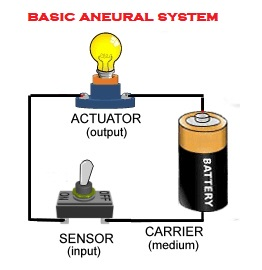

# Neural Selfness of Machines
[HOME](https://autognorics.github.io/) 

"A heat sensor can detect heat, but it does not mean it can conceive or conceptualize heat".

This article will argue that the heat sensor can actually conceive the presence of heat through the Theory of the Second Option and Codexation or Information Materialization. Once established, one of the signatures of Life called by the mainstream as self-consciousness will be invalidated, dicontinued, replaced, and rewritten. A new word, called Neural Selfness, will now supersede the debunked term. 

The ability to conceive or conceptualize is sometimes called having a “theory of mind.” However, surprisingly, this theory depends too much on the presence of the brain, specifically on its fundamentals units called neurons. Neurons are specialized cells responsible in receiving and transmitting sensory inputs and outputs from and to the nervous system and the brain. The brain is believed to be the place where information is stored and processed, while the nervous system is the super-highways that relay instructions to every muscles of the body. However, we know now that this is not always true due to the facts found in the various Linear Aneural Wise Systems (a brain without the brain) in life.

One of L.A.W.S.' intutive network is the basic aneural system below:

To be continued ...

> "Every creature is a living instruction that runs the algorithm of life." ~ Joey Lawsin
